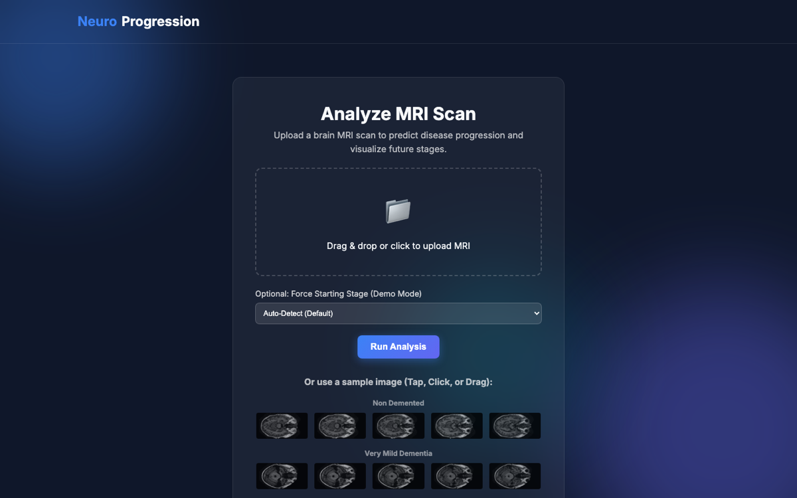

# Alzheimer's Disease Progression Analysis & Prediction

A deep learning application that analyzes MRI scans to detect Alzheimer's disease stages and generates visual progressions of the disease using Generative Adversarial Networks (GANs). The EfficientNetB4 classifier reaches **98% accuracy and 0.98 macro-F1** across four stages on 86,437 OASIS MRI slices; the ROI-aware GAN discriminator improved FID from 39.99 to 30.94 (~23%).

**[▶ Try the live demo](https://alzheimers-classifier-v1.onrender.com)** *(free-tier host — first load may take ~30s to wake)*



## Features

-   **Disease Stage Detection**: Classifies MRI scans into 4 stages:
    -   Non Demented
    -   Very Mild Dementia
    -   Mild Dementia
    -   Moderate Dementia
-   **Progression Visualization**: Generates synthetic MRI images showing how the brain might look as the disease advances to subsequent stages.
-   **User-Friendly Interface**: a web interface for uploading scans and viewing results.
-   **Mac Optimized**: Native support for Mac GPU (Metal Performance Shaders) for accelerated training and inference.

## Technology Stack

-   **Backend**: Flask (Python)
-   **AI/ML**:
    -   **Classification**: **EfficientNetB4** (Transfer Learning) with **PyTorch**.
    -   **Generation**: Deep Convolutional GANs (DCGAN) with **PyTorch**.
    -   **Hardware Acceleration**: Apple Metal (MPS) support.
    -   **Experiment Tracking**: **MLflow** for metrics, parameters, and model registry.
-   **Frontend**: HTML5, CSS3, JavaScript.
-   **Containerization**: Docker.

## Project Structure

```
├── app.py                     # Main Flask application
├── Dockerfile                 # Docker configuration
├── requirements.txt           # Python dependencies
├── src/
│   ├── pipeline.py            # Core logic for prediction and generation
│   └── ...
├── model_classifier/          # Classifier training script and model
│   ├── train_classifier.py    # PyTorch training script
│   ├── mlruns/                # MLflow tracking database
│   └── efficientnet_b4_pytorch.pth  # Trained classifier model [Git LFS]
├── gans/                      # [Large Files] PyTorch GAN Generator models
├── templates/                 # HTML templates
└── static/                    # CSS, JS, and generated images
```

## Setup & Installation

### Prerequisites

-   Python 3.9+
-   Docker (optional, recommended for deployment)
-   [Git LFS](https://git-lfs.github.com/) (required to download model weights)

### 1. Clone the Repository

```bash
git clone https://github.com/madhusiddharths/alzheimers_progression.git
cd alzheimers_progression
git lfs pull  # Download large model files
```

### 2. Run Locally (Python)

1.  Create a virtual environment:
    ```bash
    python -m venv venv
    source venv/bin/activate  # On Windows: venv\Scripts\activate
    ```
2.  Install dependencies:
    ```bash
    pip install -r requirements.txt
    ```
3.  Run the application:
    ```bash
    python app.py
    ```
4.  Open `http://127.0.0.1:5000` in your browser.

### 3. Run with Docker

Build the container:
```bash
docker build -t alzheimers-classifier .
```

Run the container:
```bash
docker run -p 5000:5000 alzheimers-classifier
```
*Note: If port 5000 is in use (common on macOS AirPlay), run on port 5001:*
```bash
docker run -p 5001:5000 alzheimers-classifier
```

### 4. MLflow Experiment Tracking

The project uses MLflow to track model training metrics (loss, accuracy), hyperparameters, and manage saved models.

1.  **Run a Training Experiment:**
    Navigate to the `model_classifier` directory and run the training script with adjustable hyperparameters:
    ```bash
    cd model_classifier
    python train_classifier.py --batch-size 32 --lr-head 1e-3 --epochs-head 10 --epochs-finetune 10
    ```
    *(Note: Add the `--fast-dev-run` flag to run a quick test on just 200 images to verify your MLflow setup).*

2.  **View the Dashboard:**
    Start the MLflow UI from the same directory where experiments were run:
    ```bash
    cd model_classifier
    mlflow ui --port 8080
    ```
    Open `http://127.0.0.1:8080` in your web browser to compare runs, metrics, and models.

## Data Sources

-   **OASIS MRI Dataset**: [Kaggle Link](https://www.kaggle.com/datasets/ninadaithal/imagesoasis)
-   **Augmented Alzheimer MRI Dataset**: [Kaggle Link](https://www.kaggle.com/datasets/uraninjo/augmented-alzheimer-mri-dataset)

## License
[MIT License](LICENSE)
